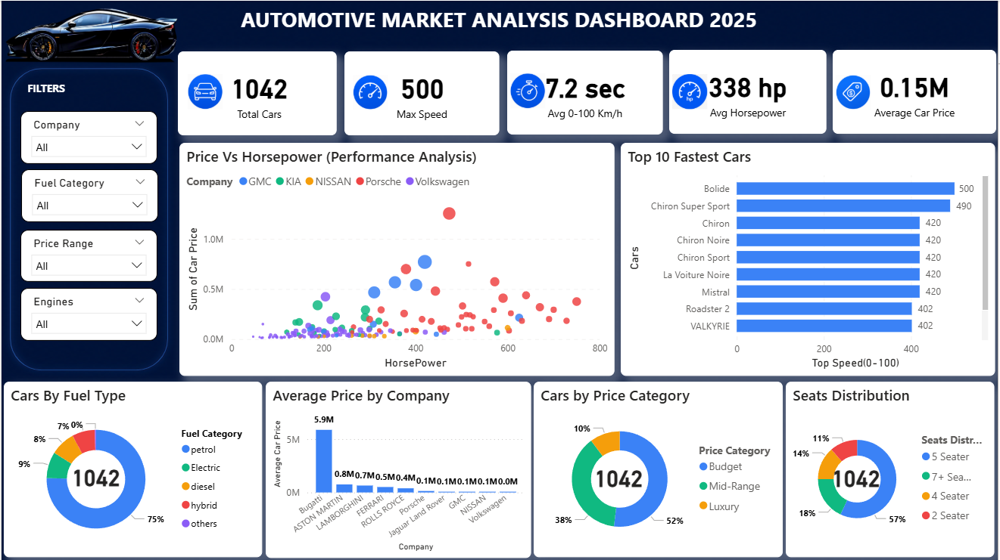

# 🚗 Automotive Market Analysis Dashboard 2025

## 📌 Project Overview
This project analyzes the automotive market using Power BI to identify trends in pricing, horsepower, fuel category, acceleration, and vehicle performance.

The dashboard helps users understand:
- Car pricing trends
- Performance analysis
- Fuel type distribution
- Seat category insights
- Fastest car comparison
- Company-wise pricing patterns

---

# 📊 Dashboard Features

## KPI Cards
- Total Cars
- Max Speed
- Avg Horsepower
- Avg 0-100 km/h Acceleration
- Average Car Price

## Visualizations
- Price vs Horsepower Scatter Plot
- Top 10 Fastest Cars
- Cars by Fuel Type
- Average Price by Company
- Cars by Price Category
- Seats Distribution

---

# 🛠 Tools Used
- Power BI
- Power Query
- DAX Measures
- Data Cleaning
- Data Modeling

---

# 🧹 Data Cleaning Process
- Removed null values
- Corrected data types
- Fixed inconsistent seat categories
- Cleaned pricing columns
- Removed duplicate/unused columns
- Standardized fuel categories

---

# 📈 Key Insights
- High horsepower vehicles generally have higher prices
- Petrol cars dominate the market
- Luxury vehicles have premium pricing
- 5-seater cars are most common
- Sports cars achieve the highest speeds

---

# 📷 Dashboard Preview

---

# 📂 Files Included
- Power BI Dashboard (.pbix)
- Dashboard Screenshots
- Custom KPI Icons
- Theme Files

---

# 🔗 Author
Swapnil Sirsat
